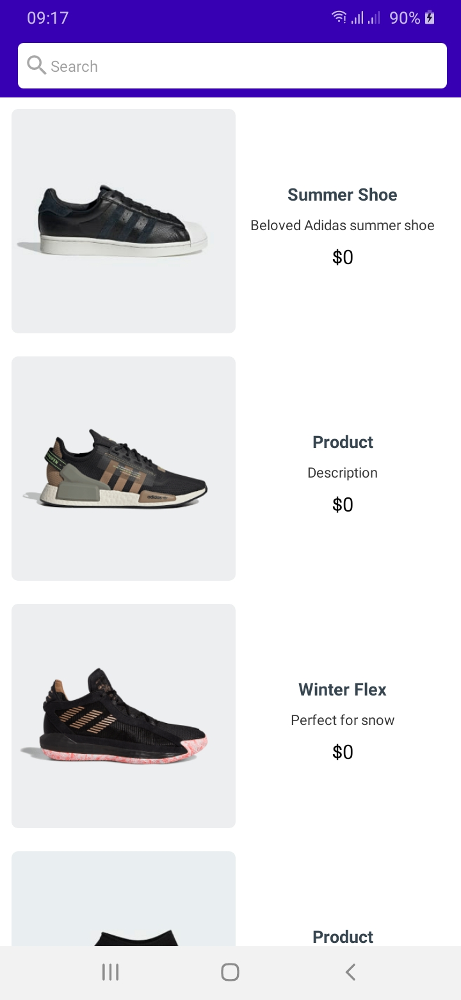
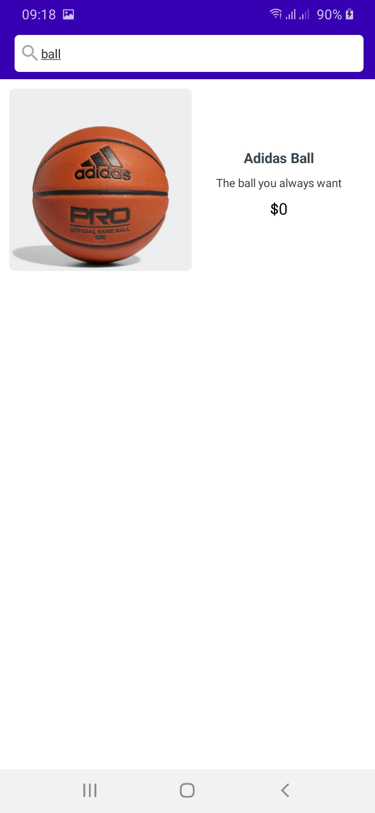
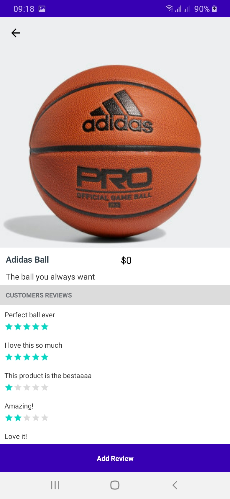
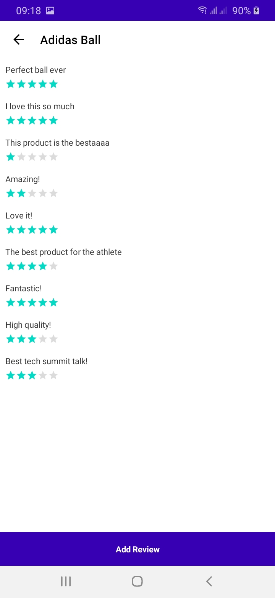
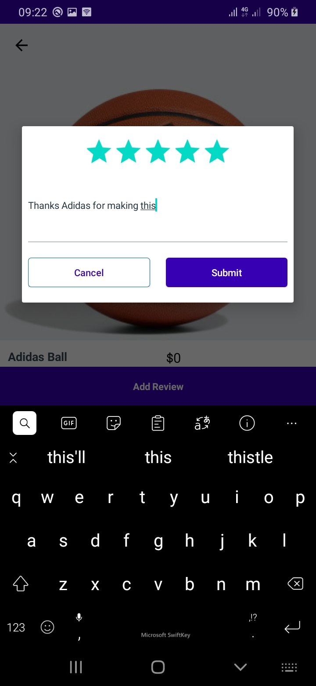

# Adidas Test App

An Android app consuming Api to display a sample list of products, built with MVVM pattern as well as Architecture Components. 

Min Api Level : 21

Build System : [Gradle](https://gradle.org/)

## Table of Contents

- [Prerequisite](#prerequisite)
- [The App](#the App)
- [Architecture](#architecture)
- [Testing](#testing)
- [Libraries](#libraries)
- [Demo](#demo)

## Prerequisite

This project uses the Gradle build system. To build this project, use the
`gradlew build` command or use "Import Project" in Android Studio. To connect to api first set up [Docker](https://www.docker.com/) in your local machine and clone `https://bitbucket.org/adichallenge/product-reviews-docker-composer.git` then run `docker-compose up` and wait for it build succesfully. Navigate to `~/src\main\java\dev\ronnie\adidasandroid\utils\Constants.kt` and replace `LOCAL_HOST` with yours. To make it work on your physical android device put your internal ip address, [Check how to get the address](https://lifehacker.com/how-to-find-your-local-and-external-ip-address-5833108#:~:text=Open%20up%20the%20Command%20Prompt,is%20your%20local%20IP%20address.)

## The App
The app loads the products the API and display it in a list. It also has Room DB for local cache.
The product list fragment has a search bar which filters the list based on the search query.
When the product is clicked, the app naviagates to Details fragment which shows a bigger picture, name, description on a collapsing toolbar and a list of reviews.The user can click add review button and a dialog opens up and if their review was submitted succefully the review list is automatically updated.

## Architecture
The app is built using the MVVM architectural pattern and make heavy use of a couple of Android Jetpack components. Mvvm allows for the separation of concern which also makes testing easier. The app has a fragment which communicates to Viewmodel which in turn communacates to the Repository to get data. 

## Testing
With MVVM testing  is made easier in that Ui can be tested separately from the businnes logic. Mocking the viewmodel to test the fragment for user interaction using espresso, mocking the repository to test the viewmodel with Junit as well as mocking the api service/dao to test the repository using the Junit. The App has tests on Fragments, viewmodels as well as network calls under the Android Test package.
 
## Libraries

Libraries used in the whole application are:

- [Jetpack](https://developer.android.com/jetpack)🚀
  - [Viewmodel](https://developer.android.com/topic/libraries/architecture/viewmodel) - Manage UI related data in a lifecycle conscious way
  - [Data Binding](https://developer.android.com/topic/libraries/data-binding) - support library that allows binding of UI components in  layouts to data sources,binds character details and search results to UI
  - [Room](https://developer.android.com/training/data-storage/room) - Provides abstraction layer over SQLite
- [Retrofit](https://square.github.io/retrofit/) - Type safe http client 
and supports coroutines out of the box.  Used for the newtwork calls.
- [Gson](https://github.com/google/gson) - Used to convert Json to Java/Kotlin classes for thr Retrofit
- [okhttp-logging-interceptor](https://github.com/square/okhttp/blob/master/okhttp-logging-interceptor/README.md) - logs HTTP request and response data.
- [kotlinx.coroutines](https://github.com/Kotlin/kotlinx.coroutines) - Library Support for coroutines
-  [Dagger2](https://dagger.dev/dev-guide/) - Used for Dependency injection
- [Glide](https://github.com/bumptech/glide) - Allows for fetching and displaying of images to imageviews

## Demo
You can get a video detaling the usage [Here](https://drive.google.com/file/d/1OsGM0QfI5sjC6SL8IFU5zMN8xWMBfXCr/view?usp=sharing)

## Screenshots

||||
|:----:|:----:|:----:|

|||
|:----:|:----:|

